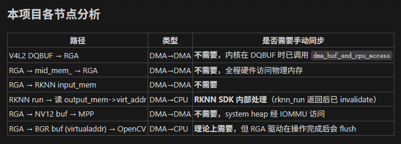

# RK3588 智慧工地安防实时检测系统

[](https://www.rock-chips.com/a/en/products/RK35_Series/2024/0412/RK3588.html)
[](https://en.cppreference.com/w/cpp/17)
[](LICENSE)

> 基于 Rockchip RK3588 边缘计算平台的实时安全穿戴检测系统。  
> 1080P@60fps 视频流 → NPU YOLOv5s 推理 → H.264 RTSP 推流 → 飞书告警。  
> **全链路 DMA-BUF 零拷贝，CPU 占用率 ~5%，端到端延迟 <200ms。**

<p align="center">
  
</p>

---

## 功能特性

- **实时检测**：5 类目标（安全帽、未戴安全帽、反光背心、未穿背心、人员），mAP@50 = 84.2%
- **零拷贝流水线**：V4L2 → RGA → NPU → MPP 四引擎 DMA-BUF 直通，CPU 不搬运像素数据
- **三线程异步架构**：采集 / 推理(3核) / 写出 流水线并行，吞吐 60 FPS
- **IoU 目标追踪**：贪心匹配 + 速度预测，分配稳定 track_id，耗时 <0.01ms
- **智能报警引擎**：漏桶防抖 + 多类别独立冷却 + 飞书 Webhook 推送 + 拍照存证
- **故障自愈**：摄像头 / NPU 异常自动检测与恢复，最多重试 3 次
- **性能分析**：内置零开销计时框架，支持 RGA vs OpenCV 专项对比测试

---

## 硬件要求

| 组件 | 要求 |
|------|------|
| 主控 | Rockchip RK3588 (推荐 Rock 5B / Orange Pi 5 Plus) |
| 摄像头 | USB UVC 或 MIPI CSI, 支持 NV12/YUYV 1080P |
| 内存 | ≥ 4GB (推荐 8GB) |
| 系统 | Linux (Armbian / Ubuntu 22.04+), 内核 ≥5.10 |

---

## 快速开始

### 1. 环境检查

```bash
git clone https://github.com/your-username/rk3588-smart-site.git
cd rk3588-smart-site

# 一键检查所有依赖
bash tools/check_env.sh
```

### 2. 安装依赖

```bash
# 基础工具链
sudo apt update
sudo apt install -y g++ cmake make pkg-config

# 运行时库
sudo apt install -y libopencv-dev
sudo apt install -y libavformat-dev libavcodec-dev libavutil-dev

# 调试工具 (可选)
sudo apt install -y v4l-utils ffmpeg
```

> Rockchip MPP / RKNN / RGA 库已预置在 `3rdparty/` 目录下，无需额外安装。

### 3. 配置第三方库

RKNN 和 RGA 的 `.so` 库文件未包含在仓库中，需自行获取后放入 `3rdparty/`：

```bash
# 方式一：从系统安装 (推荐，Rockchip 板子通常预装)
# CMake 会自动查找 3rdparty/ 目录，无需额外操作
ls /usr/lib/librknnrt.so   # 确认已安装
ls /usr/lib/librga.so      # 确认已安装

# 方式二：手动下载放入 3rdparty
# 1. librknnrt.so → 3rdparty/librknn_api/aarch64/
#    https://github.com/airockchip/rknn-toolkit2 (librknnrt.so)
# 2. librga.so    → 3rdparty/rga/RK3588/lib/Linux/aarch64/
#    https://github.com/airockchip/librga (源码编译或用预编译包)
```

### 4. 编译

```bash
# 生产模式 (零开销)
mkdir -p build && cd build
cmake .. && make -j$(nproc)

# 性能测试模式 (每300帧输出计时报告)
cmake -DBENCH_MODE=ON .. && make -j$(nproc)
```

### 5. 运行

```bash
# 最简测试：不推流，跑 1500 帧自动退出
./app --no-rtmp

# RGA vs OpenCV 性能对比
./app --bench-rga

# 完整运行：检测 + RTSP 推流 + 飞书告警
FEISHU_WEBHOOK_URL="https://open.feishu.cn/open-apis/bot/v2/hook/xxx" ./app

# 推流 + 本地录像
./app --save-local
```

**PC 端拉流验证**：
```bash
ffplay rtsp://192.168.163.8:8554/live
# 或 VLC → 打开网络串流 → 输入上述地址
```

---

## 命令行参数

| 参数 | 说明 |
|------|------|
| `--no-rtmp` | 禁用 RTSP 推流，仅本地处理 |
| `--save-local` | 同时保存视频到 `output.avi` (CPU 软编码) |
| `--bench-rga` | RGA vs OpenCV 性能对比模式 (采集一帧后退出) |

**环境变量**：

| 变量 | 说明 |
|------|------|
| `FEISHU_WEBHOOK_URL` | 飞书机器人 Webhook 地址 (不设则不推送) |

---

## 系统架构

```
Camera (V4L2 MMAP + DMA-BUF)
  │  NV12 1920×1080 @60fps
  ▼
┌─────────────────────────────────────────────────────────┐
│ [采集线程]                                               │
│   V4L2 DQ → CapturedFrame{index, dmabuf_fd}            │
│   入 readQueue (容量 4, 满了丢最老帧)                    │
└──────────────────┬──────────────────────────────────────┘
                   │
                   ▼
┌─────────────────────────────────────────────────────────┐
│ [YOLO 推理线程池 ×3]                                     │
│   ┌──────────┐  ┌──────────┐  ┌──────────┐             │
│   │ Worker 0 │  │ Worker 1 │  │ Worker 2 │             │
│   │ NPU Core0│  │ NPU Core1│  │ NPU Core2│             │
│   └──────────┘  └──────────┘  └──────────┘             │
│   每个 Worker:                                           │
│     RGA 预处理 (NV12→RGB640)  2.1ms                     │
│     RKNN 推理 (INT8)         25.5ms                     │
│     后处理 (NMS)              0.4ms                     │
│   → YoloOutputFrame{index, dmabuf_fd, detections}       │
│   入 writeQueue (容量 4)                                 │
└──────────────────┬──────────────────────────────────────┘
                   │
                   ▼
┌─────────────────────────────────────────────────────────┐
│ [写出线程]                                               │
│   IoU Tracker 匹配          0.01ms                      │
│   CPU BGRA 画框 (OSD)       <0.01ms                     │
│   RGA improcess 叠加→MPP    2.0ms                       │
│   MPP H.264 硬编码           4.2ms                      │
│   RTSP 推流                                              │
│   检测到违规 → 推送给报警引擎                             │
└──────────────────┬──────────────────────────────────────┘
                   │ 违规事件
                   ▼
┌─────────────────────────────────────────────────────────┐
│ [报警引擎线程]                                           │
│   漏桶防抖 (积分15触发, 33%漏检容错)                     │
│   每类每 track 独立 30s 冷却                             │
│   拍照存证 → 飞书 Webhook 异步推送                       │
└─────────────────────────────────────────────────────────┘
         ▲
         │ 监控
┌────────┴────────────────────────────────────────────────┐
│ [看门狗线程]                                             │
│   摄像头故障: stop→close→2s预热→re-init (最多×3)        │
│   NPU 故障:   delete ThreadPoll→new (最多×3)            │
└─────────────────────────────────────────────────────────┘
```

---

## 性能数据

### 流水线各阶段耗时 (1493 帧统计, BENCH_MODE=ON)

| 阶段 | 平均 | P99 | 说明 |
|------|------|-----|------|
| RGA 预处理 | 2.1ms | 2.6ms | NV12→RGB640 letterbox |
| NPU 推理 | 25.5ms | 30.6ms | YOLOv5s INT8, 3核并行 |
| 后处理 | 0.4ms | 0.7ms | Decode + NMS |
| IoU 追踪 | 0.01ms | 0.02ms | 贪心匹配 |
| OSD 画框 | <0.01ms | <0.01ms | CPU BGRA |
| RGA 叠加 | 3.5ms | 5.5ms | NV12 copy + BGRA blend |
| MPP 编码 | 4.2ms | 5.0ms | H.264 CBR 1080P |
| **端到端** | **16.6ms** | **22.3ms** | 含队列等待, ≈60 FPS |

### RGA vs OpenCV 性能对比

| 操作 | RGA | OpenCV | 加速比 |
|------|-----|--------|--------|
| NV12→BGR (1080P) | 1.44ms | 1.16ms | 0.8x |
| NV12→RGB + 缩放→640 | 1.63ms | 4.54ms | **2.8x** |
| BGR→NV12 (1080P) | 1.71ms | 1.06ms | 0.6x |
| BGRA→NV12 Alpha 叠加 | 3.46ms | 44.53ms | **12.9x** |

> 结论：简单色彩转换 OpenCV NEON 略快，复合操作 (缩放/叠加) RGA 碾压。本项目将 RGA 用于复合场景，正确。

### NPU 扩展性

| 核心数 | 单帧延迟 | 吞吐 | 效率 |
|--------|---------|------|------|
| 1 核 | 25.3ms | 39 FPS | 基线 |
| 2 核 | 25.5ms | 78 FPS | 98% |
| 3 核 | 25.8ms | **115 FPS** | 97% |

### 系统级指标

| 指标 | 数值 |
|------|------|
| 输入分辨率 | 1920×1080 |
| 采集帧率 | 60 FPS |
| 模型 | YOLOv5s INT8, 640×640, 5 类 |
| 模型大小 | 8.1 MB |
| CPU 占用率 | ~5% |
| 端到端延迟 | <200ms |
| mAP@50 | 84.2% |

---

## 目录结构

```
rk3588-smart-site/
├── main.cpp                 # 主程序 (四线程流水线)
├── CMakeLists.txt           # CMake 构建 (支持 BENCH_MODE 开关)
│
├── camera/                  # V4L2 摄像头采集模块
│   ├── v4l2_camera.cpp/h    # DMABUF 零拷贝采集
│   └── cma_buffer.cpp/h     # DMA-Heap 缓冲管理
│
├── yolo/                    # YOLO 推理模块
│   ├── yolov5s.cpp/h        # RGA 预处理 + RKNN 推理
│   └── post_process.cpp/h   # 后处理 (反量化/NMS)
│
├── mpp/                     # VPU 编码模块
│   ├── mpp.c/h              # MPP H.264 硬编码
│   └── mpp_encoder.cpp/h    # 编码器封装 + SPS/PPS 导出
│
├── streamer/                # RTSP 推流模块
│   ├── rtsp.cpp/h           # Live555 RTSP 服务
│   └── stream_types.h       # 编码帧数据类型
│
├── pool/                    # 线程池模块
│   └── thread_poll.cpp/h    # Future/Promise 异步调度
│
├── tracker/                 # 目标追踪模块
│   └── simple_tracker.h     # IoU 贪心匹配追踪器
│
├── bench/                   # 性能测试工具
│   ├── perf_timer.h         # RAII 计时框架 (零开销)
│   └── rga_vs_opencv.h      # RGA vs OpenCV 专项对比
│
├── tools/
│   └── check_env.sh         # 环境依赖一键检查脚本
│
├── 3rdparty/                # 第三方预编译库
│   ├── librknn_api/         #   RKNN Runtime (aarch64/armhf)
│   └── rga/                 #   RGA 库 (RK3588/RK356X/RV110X)
│
├── model/                   # 模型文件
│   ├── best.rknn            #   安全帽检测模型 (5 类)
│   ├── yolov5s.rknn         #   YOLOv5s COCO (80 类)
│   ├── helmet_labels.txt    #   安全帽标签
│   └── coco_80_labels_list.txt
│
├── docs/                    # 技术文档
│   ├── 性能基准测试计划.md
│   └── 量化计划.md
│
├── conclude/                # 项目复盘 & 面试准备
│   ├── 面试逐字书.md         #   面试逐字稿
│   ├── 总结.md              #   技术总结
│   ├── 测试方法.md           #   测试手册
│   ├── 链路.md              #   数据流详解
│   └── bug解决.md           #   Bug 记录
│
├── SafeQueue.h              # 线程安全有界队列
├── rga_utils.h              # RGA 硬件加速工具函数
├── watchdog.h               # 摄像头/NPU 看门狗
└── README.md
```

---

## 技术要点

### 零拷贝数据链路

1. **V4L2 → 用户态**：`V4L2_MEMORY_MMAP` + `VIDIOC_EXPBUF` 导出 dmabuf fd，用户态拿到的是文件描述符而非像素数据
2. **→ RGA 预处理**：`importbuffer_fd(camera_fd)` 注册给 RGA 驱动，硬件通过 IOMMU 直接 DMA 读取摄像头帧
3. **→ NPU 推理**：RGA 输出写入 `rknn_create_mem` 分配的 buffer (物理连续、带 fd)，NPU 通过 `rknn_set_io_mem` 绑定后直接读取
4. **→ RGA OSD 叠加**：`improcess(src, dst, osd)` 单次 DMA pass 完成 NV12 拷贝 + BGRA Alpha 叠加
5. **→ MPP 编码**：`mpp_buffer_import_with_tag` 导入 RGA 输出的 DMA-BUF，编码器通过 IOMMU 直接读取

**关键优化**：预缓存不变化的 RGA handle (MPP buffer fd、OSD buffer fd)，热路径仅 import 每帧变化的摄像头 fd。

### 三线程流水线

- **采集线程**：V4L2 DQ → readQueue (有界队列, 容量 4, enqueue_drop_oldest)
- **推理线程池** (×3)：readQueue → NPU → writeQueue, Future/Promise 异步, std::map 保序
- **写出线程**：writeQueue → OSD 画框 → RGA 叠加 → MPP 编码 → RTSP 推流

队列深度设计：readQueue(4) + writeQueue(4) + inflight(4) = 12 ≤ V4L2 buffer(12)，保证驱动永远不会无 buffer 可用。

### 故障自愈

- 摄像头连续失败 30 帧 → stopStreaming → closeDevice → 2s ISP 预热 → re-init
- NPU 连续失败 10 帧 → delete ThreadPoll → 300ms → new ThreadPoll 重新加载模型
- 最多重试 3 次，超限写 FATAL 日志并放弃

---

## 常见问题

**Q: `librknnrt.so: cannot open shared object file`？**
```bash
export LD_LIBRARY_PATH=$LD_LIBRARY_PATH:$(pwd)/3rdparty/librknn_api/aarch64
# 或 sudo cp 3rdparty/librknn_api/aarch64/librknnrt.so /usr/lib/
```

**Q: 摄像头打不开 `/dev/video-camera0`？**
```bash
# 创建软链接
sudo ln -s /dev/video0 /dev/video-camera0
# 或修改 main.cpp 中的设备路径
```

**Q: 如何更换模型？**
替换 `model/best.rknn`，同步更新 `model/helmet_labels.txt` 和 `yolo/post_process.h` 中的 `OBJ_CLASS_NUM`。如果是 anchor-free 模型 (YOLOv8+)，需重写 `post_process.cpp`。

**Q: 如何调整检测灵敏度？**
修改 `yolo/post_process.h` 中的 `BOX_THRESHOLD` (默认 0.65) 和 `NMS_THRESHOLD` (默认 0.45)。

---

## License

MIT License — 详见 [LICENSE](LICENSE) 文件。

---

## 致谢

- [Rockchip RKNN API](https://github.com/airockchip/rknn-toolkit2)
- [Rockchip MPP](https://github.com/rockchip-linux/mpp)
- [Rockchip RGA](https://github.com/airockchip/librga)
